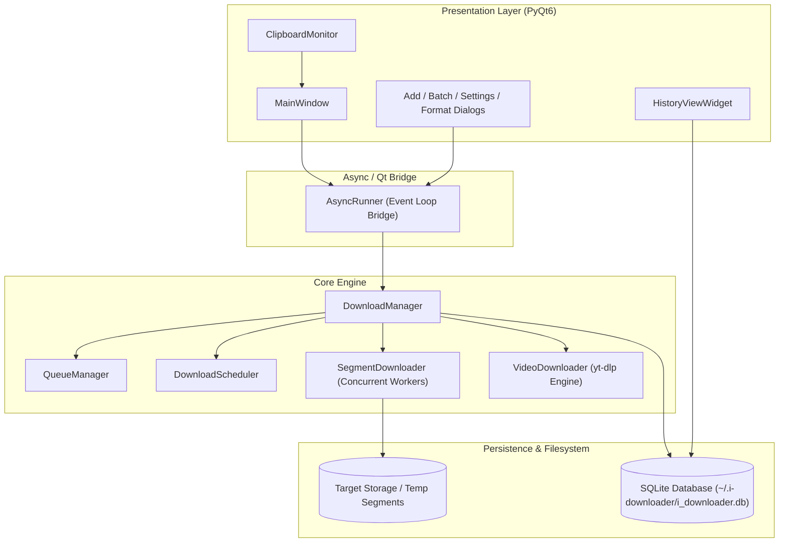

# i-Downloader

A high-performance, multi-threaded desktop download manager built with Python 3.11+ and PyQt6, powered by asyncio and SQLite persistence.

[](https://www.python.org/)
[](https://riverbankcomputing.com/software/pyqt/)
[](LICENSE)
[]()

---

## Overview

**i-Downloader** is engineered for high throughput, stability, and desktop ergonomics. It splits incoming streams into concurrent segments via HTTP Range requests, reducing transfer bottlenecks on large files. The application combines Qt's native desktop responsiveness with Python's asynchronous I/O to deliver seamless progress reporting without interface locking.

---

## Architecture

The application adopts a layered architecture separating user interface, asynchronous orchestration, download execution, and persistence:



---

## Core Features

- **Multi-Segment Downloads**: Automatically splits target files into parallel segments (default: 8 connections) using HTTP Range headers, accelerating downloads across high-latency connections.
- **Resilient Pause & Resume**: Saves incomplete segment chunks with byte-level precision, enabling interruption recovery after network disconnection or application restart.
- **Media Extraction**: Native integration with `yt-dlp` supporting video quality selection, audio extraction, and playlist parsing across 100+ platforms.
- **Automatic Categorization**: Directs files into dedicated directories (Videos, Audio, Documents, Images, Archives, Programs) based on MIME type and file extension.
- **Smart Queue & Bandwidth Throttling**: Configure maximum concurrent transfers, set global or per-item download rate limits, and prioritize queue entries.
- **Automated Scheduler**: Queue downloads to initiate at specific timestamps or off-peak hours.
- **Clipboard Monitoring**: Background URL detection prompts download actions automatically when valid media or file links are copied.
- **Data Integrity Verification**: Built-in verification engine supporting MD5, SHA1, and SHA256 hash checks with one-click validation.
- **Crash-Safe Persistence**: Download records and task statuses are committed to an embedded SQLite database with automatic recovery on restart.
- **Desktop Ergonomics**: Dark theme UI, system tray integration with background operation, and keyboard shortcuts.

---

## Keyboard Shortcuts

| Shortcut (macOS / Linux / Windows) | Action |
| :--- | :--- |
| `Cmd+N` / `Ctrl+N` | Open Add Download Dialog |
| `Cmd+B` / `Ctrl+B` | Open Batch Import Dialog |
| `Cmd+,` / `Ctrl+,` | Open Application Settings |
| `Ctrl+Shift+P` | Pause All Active Downloads |
| `Ctrl+Shift+R` | Resume All Paused Downloads |
| `Ctrl+Shift+C` | Clear Completed Downloads from View |

---

## Installation

### Prerequisites

- Python 3.11 or higher
- Optional: `ffmpeg` (required for merging high-resolution video streams and extracting audio)
  - macOS: `brew install ffmpeg`
  - Ubuntu/Debian: `sudo apt install ffmpeg`
  - Windows: `winget install Gyan.FFmpeg` or download from [ffmpeg.org](https://ffmpeg.org/)

### Option A: Using uv (Recommended - Fast)

```bash
# Clone the repository
git clone https://github.com/pondz1/i-downloader.git
cd i-downloader

# Create virtual environment and install dependencies
uv venv
source .venv/bin/activate  # On Windows: .venv\Scripts\activate
uv pip install -e ".[dev]"

# Launch application
python main.py
```

### Option B: Using standard venv and pip

```bash
# Clone the repository
git clone https://github.com/pondz1/i-downloader.git
cd i-downloader

# Create virtual environment
python3 -m venv .venv
source .venv/bin/activate  # On Windows: .venv\Scripts\activate

# Install dependencies
pip install -r requirements.txt

# Launch application
python main.py
```

---

## Project Structure

```text
i-downloader/
├── pyproject.toml              # Modern build configuration and dependencies (PEP 621)
├── requirements.txt            # Pinned requirements for standard pip workflows
├── main.py                     # Application bootstrap and Qt/Asyncio event loop runner
├── src/
│   ├── core/                   # Core download orchestrator and workers
│   │   ├── downloader.py       # Central DownloadManager controller
│   │   ├── segment.py          # Concurrent HTTP range segment worker
│   │   ├── queue_manager.py    # Priority queue and concurrent task coordinator
│   │   ├── scheduler.py        # Task scheduler for timed execution
│   │   ├── checksum.py         # MD5/SHA1/SHA256 file verification engine
│   │   ├── video_downloader.py # yt-dlp media extraction wrapper
│   │   └── file_utils.py       # Safe filesystem operations and segment merging
│   ├── models/                 # Data layer and persistence
│   │   ├── download.py         # Download task data model
│   │   └── database.py         # SQLite persistence layer and query interface
│   ├── ui/                     # Graphical user interface (PyQt6)
│   │   ├── main_window.py      # Primary application window and layout
│   │   ├── download_item.py    # Progress card widget with live speed/ETA
│   │   ├── download_dialog.py  # Single URL submission dialog
│   │   ├── batch_dialog.py     # Batch URL import dialog
│   │   ├── settings_dialog.py  # User configuration modal
│   │   ├── history_view.py     # Download history log and search
│   │   └── styles.py           # Dark theme stylesheet
│   └── utils/                  # Cross-cutting utilities
│       ├── constants.py        # Application constants and configuration paths
│       ├── helpers.py          # Formatting, URL parsing, and filename sanitization
│       ├── categories.py       # File extension and MIME type categorization
│       ├── logger.py           # Centralized logging configuration
│       └── notifications.py    # Desktop notification bridge
└── tests/                      # Automated test suite
    ├── test_checksum.py        # Checksum calculation and validation tests
    ├── test_helpers.py         # Size, speed, and filename sanitization tests
    └── test_categories.py     # Category detection tests
```

---

## Testing

The project includes unit tests for core utilities, checksum verification, and file categorization.

Run the test suite using pytest:

```bash
pytest -v
```

---

## Configuration & Data Storage

Application configuration and task states are maintained in the user profile directory:

- Database: `~/.i-downloader/i_downloader.db`
- Settings: `~/.i-downloader/settings.json`
- Application Logs: `~/.i-downloader/logs/app.log`
- Temporary Segment Cache: `~/.i-downloader/temp/`

---

## License

This project is licensed under the MIT License - see the [LICENSE](LICENSE) file for details.
